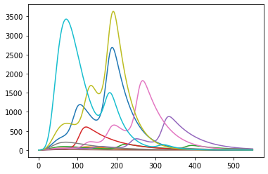
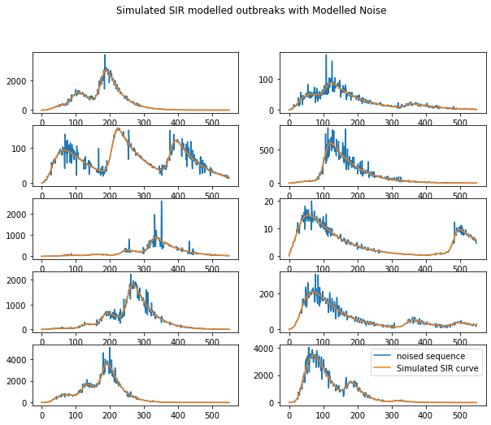

# Synthetic Covid Curve Generation

Synth_covid is a series of functions that are assocaited with the following preprint article (). This code models and generates sequences of periodic noise similar those observed during the COVID-19 pandemic. Along with this is a sample SIR model that can be combined to create realisitic looking covid outbreaks for use in downstream tasks such as modelling.

### Libraries


```python
import os
import pandas as pd
import numpy as np
from SIR_model import SIR_generation
from gen_noise_profile import get_hmm_outputs, generate_noise_sequences
import matplotlib.pyplot as plt
```

    R[write to console]: Registered S3 method overwritten by 'quantmod':
      method            from
      as.zoo.data.frame zoo 
    
    

### Pre-generated list of rt starting values


```python
obs_Rt_intercept_vec = [1.193625387,1.830699913,2.074106191,2.178497481,3.326645157,
         2.063410566,2.701420497,3.564527643,2.321210991,3.00477709,2.217962438,
         8.182968952,2.197790699,2.229650391,1.905533268,3.322893953,2.996588077,
         4.348178948,2.207955707,2.789676393,1.93297168,2.033708206,3.189707307,
         3.160619937,3.046097364,2.187819404,1.922545614,1.949726977,3.130756605,
         2.429033112,3.023799131,3.252698197,2.424760803,2.691291283,3.481094508,
         3.101700772,1.842497079,2.122283903,2.682096586,2.291348801,3.071327953,
         3.617680439,1.867263927,2.810321986,3.170675356,2.254108549,2.222822926,
         5.927286426,7.629853829,2.216177275,3.78026411,2.561284556]
```

### Get Covid Cases from JHU


```python
url = 'https://raw.githubusercontent.com/CSSEGISandData/COVID-19/master/csse_covid_19_data/csse_covid_19_time_series/time_series_covid19_confirmed_US.csv'
df = pd.read_csv(url, index_col=0)

#create index
unique_index = df['Province_State'].unique()
#aggregate to desired level
agg_df = df.groupby(['Province_State']).sum()
#create output df
input_data_df = pd.DataFrame()
#change columnar observations to single vector
for loc in unique_index:
    row_ind = agg_df[agg_df.index==loc].index[0]
    row_vals = agg_df[agg_df.index==loc].iloc[0,4:].to_numpy()
    #change from total to daily counts
    row_vals = np.diff(row_vals)
    #coerce negatives to 0s
    row_vals[row_vals<0]=0
    #trim sequences to the first observation above 5
    if len(row_vals[row_vals>5])!=0:
        start_mask = [i for i,v in enumerate(row_vals >=5) if v][0]
        row_vals = row_vals[start_mask:]
        input_data_df=input_data_df.append({'index' : row_ind, \
                                            'noise_seq' : row_vals}, ignore_index=True)

#remove cruiseship data
input_data_df=input_data_df.drop([input_data_df[input_data_df['index']=='Diamond Princess'].index[0],])
input_data_df=input_data_df.drop([input_data_df[input_data_df['index']=='Grand Princess'].index[0],])

#update index
unique_index = input_data_df['index'].unique()
```

### Generate SIR Curves


```python
output_sir_seqs = SIR_generation(n_seqs=10, pop_size=1000000, 
                   best_est_params=[0.26, 0.20, 0.42, 0.12, 0.58, 0.19, 0.33, 0.53],
                   permute_params=False, intercept_dist=obs_Rt_intercept_vec,
                   min_outbreak_threshold=100,rt_method='Rtg',all_compartments=False)
#visualise infection curves
for i in output_sir_seqs:
    plt.plot(i)
```


    

    


### Sample noise generation code


```python
output_seq = generate_noise_sequences(input_ts_list=output_sir_seqs, 
                         subset_index=unique_index,
                         input_data_df=input_data_df,
                         n_periodic_components=1, white_noise=False, 
                         white_noise_weight = 0.05, shuffle_permute=True,
                         shuffle_prob = 30, smooth_transitions=False)
```

    Modelling 0 order noise. May take a minute.
    working on Alabama
    

    C:\Users\u6026797\Anaconda3\lib\site-packages\statsmodels\regression\linear_model.py:1434: RuntimeWarning: invalid value encountered in sqrt
      return rho, np.sqrt(sigmasq)
    

    working on Alaska
    working on Arizona
    working on Arkansas
    working on California
    working on Colorado
    working on Connecticut
    working on Delaware
    working on District of Columbia
    working on Florida
    working on Georgia
    working on Guam
    working on Hawaii
    working on Idaho
    working on Illinois
    working on Indiana
    working on Iowa
    working on Kansas
    working on Kentucky
    working on Louisiana
    working on Maine
    working on Maryland
    working on Massachusetts
    working on Michigan
    working on Minnesota
    working on Mississippi
    working on Missouri
    working on Montana
    working on Nebraska
    working on Nevada
    working on New Hampshire
    working on New Jersey
    working on New Mexico
    working on New York
    working on North Carolina
    working on North Dakota
    working on Northern Mariana Islands
    working on Ohio
    working on Oklahoma
    working on Oregon
    working on Pennsylvania
    working on Puerto Rico
    working on Rhode Island
    working on South Carolina
    working on South Dakota
    working on Tennessee
    working on Texas
    working on Utah
    working on Vermont
    working on Virgin Islands
    

    C:\Users\u6026797\Documents\GitHub\synth_covid\python\gen_noise_profile.py:224: RuntimeWarning: invalid value encountered in true_divide
      qpc = (adj_vec[:max_pacf_val]/seq_sum)
    

    working on Virginia
    working on Washington
    working on West Virginia
    working on Wisconsin
    working on Wyoming
    

### Visualize sample noised curves


```python
Tot = 10
Cols = 2
Rows = Tot // Cols 
Rows += Tot % Cols

# Create a Position index
plt.figure(figsize=(10,8))
Position = range(1,Tot + 1)
fig = plt.figure(1)
for k in range(Tot):
  ax = fig.add_subplot(Rows,Cols,Position[k])
  ax.plot(output_seq[k],label='noised sequence')
  ax.plot(output_sir_seqs[k],label='Simulated SIR curve')
ax.legend()
fig.suptitle('Simulated SIR modelled outbreaks with Modelled Noise')
```


    Text(0.5, 0.98, 'Simulated SIR modelled outbreaks with Modelled Noise')


    

    

